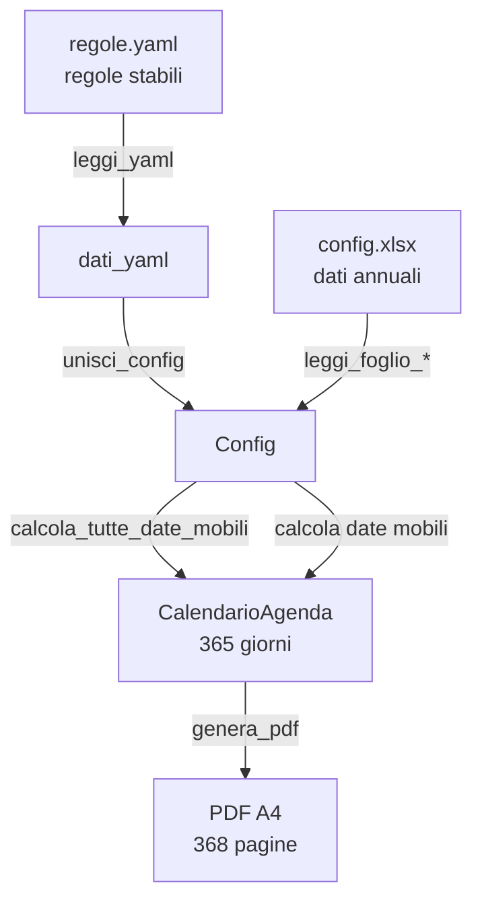

# Architettura del progetto

Documento tecnico che descrive le scelte architetturali del progetto
**Agenda Parrocchiale**. Per sviluppatori e manutentori.

---

## Indice

1. [Panoramica](#1-panoramica)
2. [Flusso di esecuzione](#2-flusso-di-esecuzione)
3. [Struttura del codice](#3-struttura-del-codice)
4. [Moduli principali](#4-moduli-principali)
5. [Fonti di dati](#5-fonti-di-dati)
6. [Pattern e convenzioni](#6-pattern-e-convenzioni)
7. [Dipendenze](#7-dipendenze)
8. [Testing](#8-testing)

---

## 1. Panoramica

Il progetto è un **generatore automatico di agende liturgiche**.
Prende in input:
- Un file **Excel** con i dati annuali (orari, intenzioni, matrimoni)
- Un file **YAML** con le regole stabili (feste, ricorrenze, divieti)

E produce in output:
- Un **PDF A4** impaginato per la tipografia

### Principi di design

| Principio | Come è applicato |
|---|---|
| **Separazione dati/regole** | Excel = dati annuali, YAML = regole stabili |
| **Multi-profilo** | Ogni parrocchia ha la sua cartella in `configs/` |
| **Warning non bloccanti** | Errori di compilazione → warning + riepilogo finale |
| **Testabilità** | Funzioni piccole, testate al 86% |
| **Estendibilità** | Aggiungere festa = riga YAML, non codice |

---

## 2. Flusso di esecuzione

Il flusso è suddiviso in **3 fasi**: lettura, calcolo, rendering.

### Diagramma completo



### Fase 1 — Lettura

| Step | Input | Funzione | Output |
|---|---|---|---|
| 1 | `regole.yaml` | `leggi_yaml()` | `dati_yaml` (dict) |
| 2 | `config.xlsx` | `leggi_foglio_impostazioni()`<br/>`leggi_foglio_intenzioni()`<br/>`leggi_foglio_matrimoni()`<br/>`leggi_foglio_note()` | `dati_excel` (dict) |
| 3 | `dati_yaml` + `dati_excel` | `unisci_config()` | `Config` (dataclass) |

### Fase 2 — Calcolo

| Step | Input | Funzione | Output |
|---|---|---|---|
| 1 | `Config.anno` | `calcola_tutte_date_mobili()` | `dict` di date mobili |
| 2 | `Config` + date mobili | `genera_agenda()` | `CalendarioAgenda` (365 giorni) |

### Fase 3 — Rendering

| Step | Input | Funzione | Output |
|---|---|---|---|
| 1 | `CalendarioAgenda` + `Config` | `genera_pdf()` | `PDF A4` (368 pagine) |

### I 3 moduli chiave

| Modulo | Fase | Responsabilità |
|---|---|---|
| `config.py` | Lettura | Unisce YAML + Excel in `Config` |
| `generatore_agenda.py` | Calcolo | Trasforma `Config` in `CalendarioAgenda` |
| `generatore_pdf.py` | Rendering | Trasforma `CalendarioAgenda` in PDF |

---

## 3. Struttura del codice
```
src/
├── stili.py                    # Stili Excel (colori, font, bordi)
├── util.py                     # Utility (logging, formattazione, helper)
│
├── dataclass_config.py         # Dataclass condivise (Periodo, Festa, ...)
│
├── lettura_yaml.py             # Lettura regole.yaml
├── lettura_excel.py            # Lettura config.xlsx (4 fogli)
├── config.py                   # unisci_config, carica_config
│
├── calcolo_liturgico.py        # Pasqua, feste mobili, 9 mercoledì
├── generatore_agenda.py        # Calendario giorno per giorno
│
├── fogli_excel.py              # Creazione dei 4 fogli Excel
├── crea_config_template.py     # CLI: genera config.xlsx
│
└── generatore_pdf.py           # HTML → PDF (WeasyPrint)
```

---

## 4. Moduli principali

### `calcolo_liturgico.py`

Calcola tutte le date mobili dell'anno liturgico a partire dalla **Pasqua**.

| Funzione | Cosa calcola | Delta Pasqua |
|---|---|---|
| `calcola_pasqua` | Pasqua (Meeus/Jones/Butcher) | — |
| `calcola_mercoledi_ceneri` | Ceneri | -46 |
| `calcola_domenica_palme` | Palme | -7 |
| `calcola_giovedi_santo` | Giovedì Santo | -3 |
| `calcola_venerdi_santo` | Venerdì Santo | -2 |
| `calcola_sabato_santo` | Sabato Santo | -1 |
| `calcola_lunedi_angelo` | Lunedì Angelo | +1 |
| `calcola_ascensione` | Ascensione | +39 |
| `calcola_pentecoste` | Pentecoste | +49 |
| `calcola_trinita` | Trinità | +56 |
| `calcola_corpus_domini` | Corpus Domini | +60 |
| `calcola_domeniche_quaresima` | 5 domeniche | (calcolo) |
| `calcola_domeniche_avvento` | 4 domeniche | (calcolo) |
| `calcola_nove_mercoledi` | 9 mercoledì San Salvatore | (calcolo) |
| `calcola_festa_voto` | Con slittamento | (calcolo) |
| `calcola_tutte_date_mobili` | **API pubblica** | — |

### `generatore_agenda.py`

Costruisce il **CalendarioAgenda** (365 giorni).

| Funzione | Cosa fa |
|---|---|
| `determina_tipo_giorno` | "feriale", "domenica", "festivo" |
| `festivo_fisso` | Cerca nei festivi fissi |
| `trova_periodo` | Trova il periodo attivo (ciclico, mese/giorno) |
| `orari_per_giorno` | Orari per tipo + periodo |
| `applica_eccezioni_orari` | Orari ridotti, salta se domenica |
| `applica_divieti_pomeridiani` | Rimuove orari ≥ 14:00 |
| `festivita_del_giorno` | Nome + flag "particolare" |
| `intenzioni_del_giorno` | Collega intenzioni |
| `matrimoni_del_giorno` | Collega matrimoni |
| `note_del_giorno` | Collega note |
| `matrimoni_futuri` | Matrimoni degli anni successivi (per pagina finale) |
| `genera_agenda` | **API pubblica** |
| `genera_agenda_da_profilo` | Wrapper |

### `config.py`

Unisce YAML + Excel in un unico oggetto `Config`.

| Funzione | Cosa fa |
|---|---|
| `unisci_config` | Merge con regola "YAML vince su dati stabili" |
| `carica_config` | **API pubblica** (legge file, unisce, restituisce) |

### `generatore_pdf.py`

Trasforma il `CalendarioAgenda` in un PDF A4 impaginato.

| Funzione | Cosa fa |
|---|---|
| `configura_jinja` | Configura l'ambiente Jinja2 |
| `renderizza_copertina` | HTML copertina |
| `renderizza_giorno` | HTML di un giorno |
| `renderizza_registro_intenzioni` | HTML del registro intenzioni |
| `renderizza_matrimoni_futuri` | HTML prenotazioni matrimoni anno successivo |
| `leggi_css` | Legge `templates/style.css` |
| `estrai_body` | Estrae il contenuto del `<body>` |
| `assembla_html` | Assembla tutto l'HTML completo |
| `genera_pdf` | **API pubblica** (HTML → PDF) |
| `genera_pdf_da_profilo` | Wrapper |

---

## 5. Fonti di dati

### `regole.yaml` (per profilo)

Dati **stabili** che non cambiano anno per anno.

| Sezione | Contenuto |
|---|---|
| `festivi_fissi` | Feste a data fissa (Natale, San Francesco, ...) |
| `eccezioni_festivi` | Orari ridotti, salta se domenica |
| `divieti_pomeridiani` | Assunta, San Nicola, Corpus Domini |
| `ricorrenze_proprie` | Triduo, San Salvatore, Festa del Voto |
| `nove_mercoledi` | Orario e regola |
| `celebrazioni_mobili` | Feste dipendenti dalla Pasqua |
| `giorni_accorpati` | Venerdì+Sabato Santo |
| `matrimoni` | Giorni, mese escluso |
| `intenzioni` | Righe per defunto, numerazione |

### `config.xlsx` (per profilo)

Dati **annuali** che l'utente compila.

| Foglio | Contenuto |
|---|---|
| **Impostazioni** | Anno, nome, città, periodi stagionali |
| **Intenzioni** | Registro intenzioni (5 colonne) |
| **Matrimoni** | Prenotazioni matrimoni (anno corrente e anni successivi) |
| **Note** | Annotazioni libere |

### Regola dell'override

| Dato | Vince | Motivo |
|---|---|---|
| Anno | Excel | Dato annuale |
| Nome parrocchia | YAML | Dato "ufficiale" |
| Città | YAML | Dato "ufficiale" |
| Orari stagionali | Excel | Variabili di anno in anno |
| Feste, ricorrenze | YAML | Stabili nel tempo |

---

## 6. Pattern e convenzioni

### Naming

| Cosa | Convenzione | Esempio |
|---|---|---|
| Moduli | snake_case | `calcolo_liturgico.py` |
| Funzioni | snake_case | `calcola_pasqua()` |
| Classi | PascalCase | `CalendarioAgenda` |
| Costanti | UPPER_SNAKE | `FORMATO_LOG` |
| Funzioni private | (nessuna, tutte pubbliche) | `trova_periodo()` |

**Nota:** tutte le funzioni sono **pubbliche** (senza `_`) per facilitare il testing.

### Dataclass

Tutte le strutture dati usano `@dataclass` con:
- **Type hint** obbligatori
- **`field(default_factory=list)`** per le liste
- **Docstring** con `Attributes:`

### Gestione errori

| Livello | Comportamento |
|---|---|
| **Dati obbligatori** (anno, nome, città) | `raise ValueError` |
| **Righe opzionali** (periodi, intenzioni) | `logger.warning` + ignora |
| **Errori di I/O** (file mancanti) | `raise FileNotFoundError` |

### Warning e riepilogo finale

```
1. Durante la lettura: warning + ignora
2. WarningCollector accumula
3. A fine script: mostra_riepilogo_warning()
4. Utente decide se procedere
```

### Logging

Formato: `[LIVELLO] nome_modulo: messaggio`

Esempio:
```
[WARNING] lettura_excel: Impostazioni, riga 15: 'Dal' o 'Al' mancante. Riga ignorata.
[INFO] generatore_agenda: Generazione agenda per l'anno 2027
```

---

## 7. Dipendenze

### Runtime

| Libreria | Versione | Scopo |
|---|---|---|
| `openpyxl` | >= 3.1.2 | Lettura/scrittura Excel |
| `PyYAML` | >= 6.0.1 | Lettura YAML |
| `Jinja2` | >= 3.1.3 | Template HTML |
| `WeasyPrint` | >= 61.0 | HTML → PDF |
| `python-dateutil` | >= 2.9.0 | Utility date |
| `pytz` | >= 2024.1 | Fusi orari |

### Sviluppo

| Libreria | Versione | Scopo |
|---|---|---|
| `pytest` | >= 8.0.0 | Testing |
| `pytest-cov` | >= 4.1.0 | Coverage |
| `black` | >= 24.1.0 | Formattazione |
| `isort` | >= 5.13.0 | Ordine import |
| `flake8` | >= 7.0.0 | Linting |
| `mypy` | >= 1.8.0 | Type checking |

---

## 8. Testing

### Coverage

| Modulo | Coverage |
|---|---|
| `calcolo_liturgico.py` | 100% |
| `dataclass_config.py` | 100% |
| `fogli_excel.py` | 100% |
| `util.py` | 100% |
| `stili.py` | 99% |
| `generatore_pdf.py` | 98% |
| `generatore_agenda.py` | 97% |
| `lettura_excel.py` | 96% |
| `config.py` | 94% |
| `lettura_yaml.py` | 89% |
| `crea_config_template.py` | 0% (CLI, difficile) |
| **TOTALE** | **86%** |

### Comandi

```bash
# Tutti i test
pytest tests/ -v

# Con coverage
pytest tests/ --cov=src --cov-report=term-missing

# Solo un modulo
pytest tests/test_calcolo_liturgico.py -v

# Solo un test
pytest tests/test_calcolo_liturgico.py::test_calcola_pasqua_2027 -v
```

### Convenzioni test

- Un file di test per modulo (`test_<modulo>.py`)
- Fixture condivise nella parte alta del file
- Test **deterministici** (nessuna dipendenza da data corrente)
- Test **isolati** (nessun side effect tra test)

---

## Estensioni future

Idee per il futuro (non implementate):

| Idea | Complessità |
|---|---|
| Web app multi-parrocchia (SaaS) | Alta |
| Editor visuale template PDF | Media |
| Import intenzioni da CSV | Bassa |
| Notifiche email per matrimoni | Bassa |
| App mobile per consultazione | Alta |
| Integrazione con calendario Google | Media |

---

Per domande tecniche: [apri una issue](https://github.com/hac114/agenda-parrocchiale/issues).
